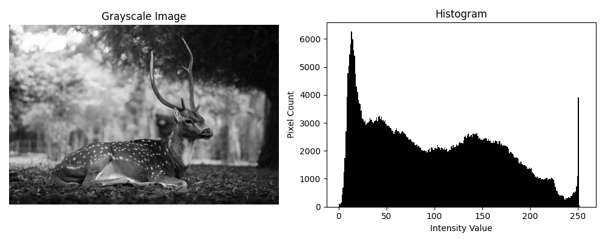

### * Pixo-Analysee

Pixo-Analysee（Pixel-Analyzer）は画像処理・解析の練習を行うための**開発環境**です。画像処理・解析において、こちらの環境を使用することは推奨しません。あくまで、処理に使用したスクリプトや画像を保存しておくためのリポジトリとなります。

<br>

<div align="center">
    <a href="#">
        
    </a>
</div>

<br>

### * Environment

uvを使用して環境を構築しています。


#### install

```bash
git clone https://github.com/Sakamochanq/Pixo-Analysee.git
cd pixo-analysee
```

#### run

```bash
uv run main.py
```

#### package

```bash
uv add opencv-python numpy matplotlib
```

* numpy
* matplotlib
* opencv-python

<br>

### * Author

[Sakamochanq](https://github.com/Sakamochanq) - Developer

<br>
